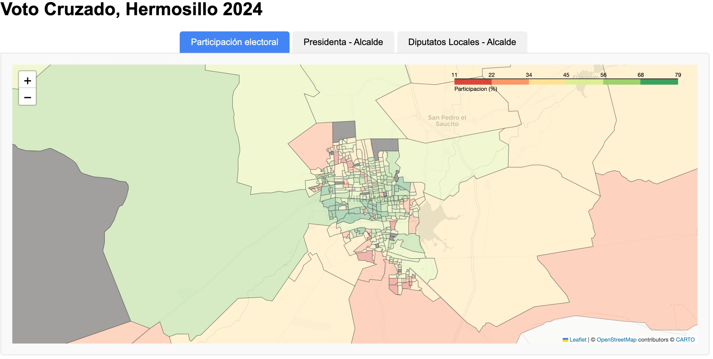

# Hermosillo Election Results Visualization Project

This project is a Python-based interactive tool developed with Python in Google Colab to visualize and analyze election results in Hermosillo, Mexico. The primary focus is on exploring cross-voting behavior in the 2024 elections, where voters supported Claudia Sheinbaum, the progressive Morena party candidate, in the presidential race but favored the conservative PAN candidate for the mayoral race.

The interactive maps are available here: https://laurauguc.github.io/cross-voting/

## Project Context

The 2024 election cycle was historically significant for several reasons:
- **Claudia Sheinbaum's Candidacy**: Sheinbaum became the first woman to win the presidency in Mexico and achieved the largest landslide victory in the country's history.
- **Cross-Voting Patterns**: Despite Morena's substantial national-level success, cross-voting behaviors were observed in Hermosillo, where voters chose a conservative mayor.

This project aims to shed light on these complex voting dynamics through interactive mapping.

## Key Findings

- **Distinct Voting Patterns**:  The analysis reveals a significant cross-voting trend in Hermosillo, with varying levels of support for the Morena party between federal and local races. Wealthier neighborhoods consistently favored conservative candidates at all levels, indicating a strong preference for traditional party alignments.

- **Contrasting Local vs. Federal Support**  In less affluent areas, voters demonstrated robust support for Morena in both the presidential and local congressional races, benefiting from the party's increasing popularity and national momentum. However, they chose conservative candidates for the mayoral position, highlighting a divergence in voting behavior.

- **Strategic Implications**: These insights underscore that Morena's strong federal brand does not necessarily translate uniformly into local electoral success. While local congressional races are influenced by this branding, it lacks the same impact in mayoral contests, where candidates are more familiar to voters and possess their unique identities. This suggests that regional dynamics and voter preferences are critical, emphasizing the need for tailored campaign strategies in local elections.ynamics and voter preferences play a critical role, emphasizing the importance of tailored campaign strategies for local elections.

## Project Features

- **Interactive Maps**: Users can explore the voting distribution and cross-voting trends across different neighborhoods in Hermosillo.
- **Data Analysis**: The tool employs geospatial data visualization techniques to show varying levels of support for federal and local candidates.
- **Insightful Visualizations**: Maps and charts that break down the support by neighborhood, illustrating economic and social contrasts.

## Tools and Libraries Used

- **Python**: Core programming language used for data processing and visualization.
- **Google Colab**: Provides a collaborative and easy-to-use environment for executing the code.
- **Pandas**: For data manipulation and analysis.
- **Geopandas**: For working with geospatial data.
- **Folium**: To create interactive maps that display election results by region.

## Usage Instructions

1. **Open in Colab**: Clone the repository and open the `election_results_analysis.ipynb` file in Google Colab, or open directly from GitHub.
3. **Run the Code**: Follow the cell-by-cell instructions to load, process, and visualize the data interactively.

OR: view the output visualizations at this site: https://laurauguc.github.io/cross-voting/

## How to Interpret the Visualizations

- **Federal vs. Local Support**: Use the map tabs to toggle between voter participations, the difference between presidential and mayoral results, and the difference between local congress and mayoral results.
- **Neighborhood Analysis**: Hover over regions on the map to view detailed voting statistics, revealing socio-economic voting patterns.
- **Cross-Voting Indicators**: Special color-coding highlights areas where voters showed significant divergence between federal and local preferences.

## Conclusions and Implications

This analysis underscores the complex voter behavior in Hermosillo:
- Morena’s federal appeal is not fully mirrored in local-level elections. It impacts local congressional races but to a much lesser degree mayoral contests, where candidates are more familiar to voters and possess their unique identities. 
- Strategic campaign efforts must address these disparities to bolster local support.
- Conservative parties may find opportunities to consolidate their presence in local elections despite shifting national trends.

These findings offer valuable insights for political analysts, campaign strategists, and researchers focused on electoral behavior and regional political dynamics.

## Future Work

Further research could include:
- **Expanding the analysis to other regions** in Mexico to see if similar cross-voting patterns exist.
- **Investigating the impact of socio-economic factors** on voter behavior more deeply.
- **Integrating more detailed demographic data** for a comprehensive analysis.
- **Statistically analyze the visual voting patterns** to understand Statistical significance levels.

---

## Interactive Visualization

Below is an embedded version of `index.html`, which contains the interactive geographical visualization for a deeper analysis:

Click on the image.

